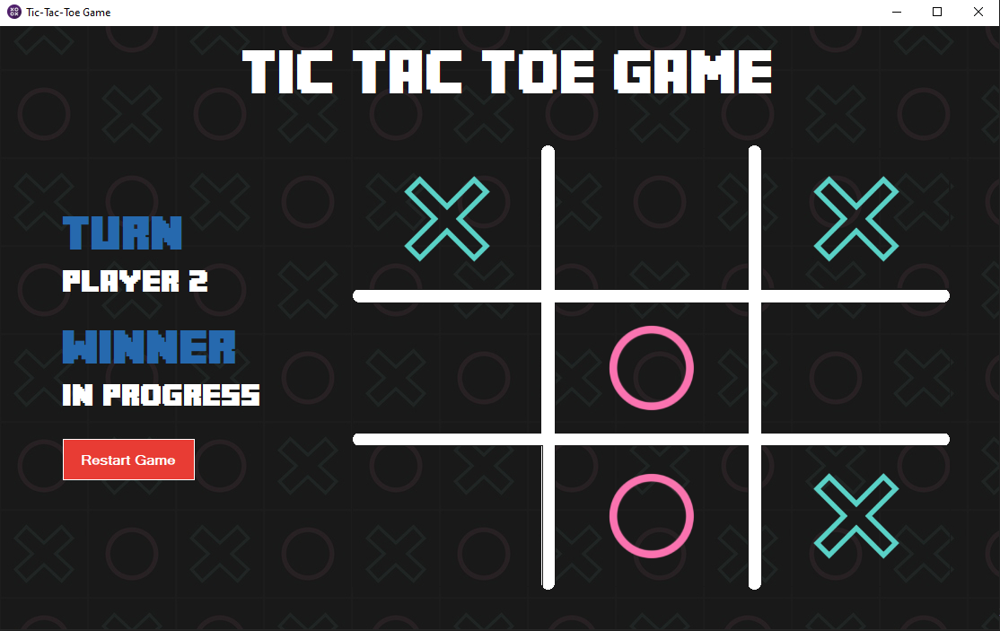

# 🎮 Tic Tac Toe Game (C# Windows Forms)

A classic **Tic-Tac-Toe** game featuring a retro-style GUI built with C# and .NET Windows Forms.



---

## ✨ Features

* **Two-Player Mode:** Play locally with a friend (Player 1 vs Player 2).
* **Interactive UI:** Smooth grid rendering using custom GDI+ graphics (`Form1_Paint`).
* **Win & Draw Detection:** Automatic check for winning combinations (rows, columns, diagonals) and tie games.
* **Highlight Winning Cells:** Automatically highlights the winning cells upon victory.
* **Turn & Status Tracker:** Real-time feedback showing current player turn and game state.
* **Restart Functionality:** Reset board and game parameters at any time with a single click.

---

## Tech Stack & Requirements

* **Language:** C#
* **Framework:** .NET Framework (Windows Forms)
* **IDE:** Visual Studio 2026

---

## How to Run

1. **Clone the repository:**
   ```bash
   git clone [https://github.com/your-username/Tic-Tac-Toe-Game.git](https://github.com/your-username/Tic-Tac-Toe-Game.git)

2. **Open Project:**
   Open the solution file (`.sln`) in **Visual Studio**.

3. **Build & Run:**
   Press `F5` or click **Start** to build and launch the application.

---

## How to Play:

1. Player 1 starts first as **X**, followed by Player 2 as **O**.
2. Click on any empty grid slot to place your mark.
3. The first player to align 3 symbols horizontally, vertically, or diagonally wins!
4. Click **Restart Game** to begin a new round.